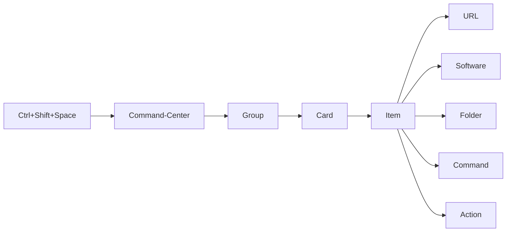

# Command-Center

> Personal Windows desktop control center - every tool, URL, folder, script, and system action in one keyboard-driven hub.

**Version:** 0.1.0-beta · **Platform:** Windows 10/11 x64 · **Status:** Feature complete, pre-release

---

## Why this exists

Windows power users end up with the same fragmented setup: scripts handling some things, bookmarks handling others, pinned apps handling more, and memory filling the rest. The context-switching overhead compounds across every session.

The specific problem: there was no single place to go. Launching a tool meant remembering where it lived. Finding a URL meant knowing which browser profile it was bookmarked in. Running a script meant opening the right folder first. Nothing was connected, and the mental overhead compounded across every session.

Command-Center was built to solve this in a way no existing tool did - not a browser extension, not a Start Menu replacement, not a note-taking app with links bolted on. A dedicated Windows desktop app: one global keyboard shortcut, one organized interface, every tool type in one place. `Ctrl+Shift+Space` from any app, find anything, launch it, done.

The groups in the app aren't example data - they're real working domains: Daily Routine, AutoHotkey, Electron, N8N, Data_Analytics, Python, Bookmarks. That's the actual shape of a developer and automation engineer's daily workflow.


---

## Vision - Project Dashboard (Phase 14)

Command-Center is designed to evolve beyond a pure launcher into a **personal project dashboard** - a single window that reflects not just what you can open, but the state of what you're working on.

Each Group represents a working domain or project. The planned Phase 14 upgrade adds:

- **Status** - Building / Shipped / Stalled / On Hold, visible at a glance on the Home screen
- **Description** - free-text project context: what it is, what's next, current blockers
- **Deadline** - optional target date per project

The Home screen evolves from a favorites/recents view into a command center in the truest sense: project status at a glance, with one click to jump into the launcher for that domain.

See `docs/PHASE_14_PROJECT_DASHBOARD.md` for the full spec.

---

## Overview

Items live in cards, cards live in groups, and every item launches in one click or keystroke. A remappable global shortcut (`Ctrl+Shift+Space`) brings the window forward from any app - even when hidden to the system tray.




---

## Item types

| Type | What it does |
|---|---|
| **URL** | Opens in a built-in resizable webview panel. Favicon fetched and cached automatically. |
| **Software** | Launches any `.exe`, `.bat`, or `.cmd` with optional args and working directory. |
| **Folder** | Opens any folder in Windows Explorer. |
| **Command** | Runs a terminal command with args and CWD. Includes fill templates for PowerShell, Node, Python, git, npm. |
| **Action** | One-click Windows system actions: lock screen, sleep, Task Manager, Run dialog, screenshot, calculator, and more. |

---

## Features

- **Global shortcut** - `Ctrl+Shift+Space` (remappable in Settings → Shortcuts) shows/hides the window from any app
- **System tray** - closing the window hides to tray; the app stays alive and reachable
- **Embedded webview** - URL items open inline in a resizable right or bottom panel with nav controls
- **Fuzzy search** - searches labels, paths, tags; full-text note search via SQLite FTS5
- **Home screen** - drag-reorderable pinned favorites + recent launches with relative timestamps
- **Icon system** - 6 input methods: auto-favicon, emoji, 1460 Lucide icons with custom color, local file upload, remote URL, base64
- **Item notes + tags** - each item supports a 450-word description and unlimited tags, searchable via FTS5
- **Auto-backup** - snapshot on every write, rolling 10 kept; export/import via ZIP
- **Settings** - dark/light theme, font size (small/medium/large), density, launch on startup, minimize to tray, webview position
- **Group & Card Manager** - bulk select, recolor, delete, and move groups, cards, and items
- **Portable** - all data stored locally in `%APPDATA%\Command-Center\`; no cloud, no telemetry

---

## Screenshots

> Run `npm run dev` to see the live app. Screenshots pending first public release.

---

## Getting started

### Prerequisites

- Windows 10 or 11 (x64)
- Node.js v18+ (v22 recommended)
- Visual Studio Build Tools 2022 with **Desktop development with C++** workload - required by `better-sqlite3`

### Install

```bash
git clone https://github.com/wsnh2022/command-center.git
cd command-center
npm install
```

If `better-sqlite3` fails to compile against the installed Electron version:

```bash
npm run rebuild
```

### Dev

```bash
npm run dev
```

> **Note:** If icons appear broken after a first launch, stop the dev server and restart - the `command-center-asset://` protocol registers at app startup and cannot be hot-reloaded.

### Build installer

```bash
npm run dist
```

Outputs to `release/`:
- `Command-Center Setup 0.1.0-beta.exe` - NSIS installer (~86MB, includes Electron runtime)
- `Command-Center 0.1.0-beta.exe` - portable executable
- `win-unpacked/` - unpacked build directory

> The `predist` script wipes `release/` before every build. Quit the app from the system tray before running `npm run dist` or the build will fail with a file-lock error.


---

## Tech stack

| Library | Version | Purpose |
|---|---|---|
| Electron | 30 | Desktop shell, BrowserWindow, BrowserView |
| React | 18 | UI framework |
| TypeScript | 5 | Type safety throughout |
| Vite + electron-vite | 5 / 2 | Build tooling, HMR |
| Tailwind CSS | 3 | Styling via design tokens |
| better-sqlite3 | 9 | Local SQLite, WAL mode |
| fuse.js | 7 | Fuzzy search |
| @dnd-kit | 6 / 8 | Drag-and-drop reordering |
| lucide-react | 0.378 | Icons (1460, loaded on-demand) |
| jszip | 3 | Export/import ZIP archives |

---

## Data storage

All data is local. No cloud, no telemetry, no accounts.

| Path | Contents |
|---|---|
| `%APPDATA%\Command-Center\command-center.db` | Main SQLite database |
| `%APPDATA%\Command-Center\backups\` | Auto-backup snapshots (rolling 10) |
| `%APPDATA%\Command-Center\assets\icons\` | Uploaded and URL-fetched icons |
| `%APPDATA%\Command-Center\assets\favicons\` | Cached favicons |

---

## Architecture

- **Frameless window** with custom drag region in TopBar (`-webkit-app-region: drag`)
- **No renderer Node access** - `contextIsolation: true`, `nodeIntegration: false`; all system calls route through typed IPC channels in `electron/preload.ts`
- **Custom asset protocol** - `command-center-asset://relative/path` maps to `%APPDATA%\Command-Center\` with path traversal protection
- **State-based router** - no react-router; `activePage` union type drives `renderPage()` in `App.tsx`
- **Dynamic Lucide loading** - barrel excluded from Vite pre-bundling; icons loaded individually on demand via `dynamicIconImports` to prevent ~1MB startup overhead
- **Auto-backup on every write** - `backup.service.autoBackup()` called from every IPC handler that mutates data

---

## Keyboard shortcuts

| Shortcut | Action |
|---|---|
| `Ctrl+Shift+Space` | Show / hide window (global, works from any app) |
| `↑ / ↓` | Navigate search results |
| `Enter` | Launch selected search result |
| `Escape` | Close search / close modals |

The global shortcut is remappable in **Settings → Shortcuts**.

---

## Project status

**v0.1.0-beta** - all 13 build phases complete. Fully functional for daily use.

- `PROGRESS.md` - session-by-session development log
- `RESUME.md` - full phase tracker, file inventory, and deferred work
- `docs/PHASE_14_PROJECT_DASHBOARD.md` - next phase spec

---

## Author

[wsnh2022](https://github.com/wsnh2022)
